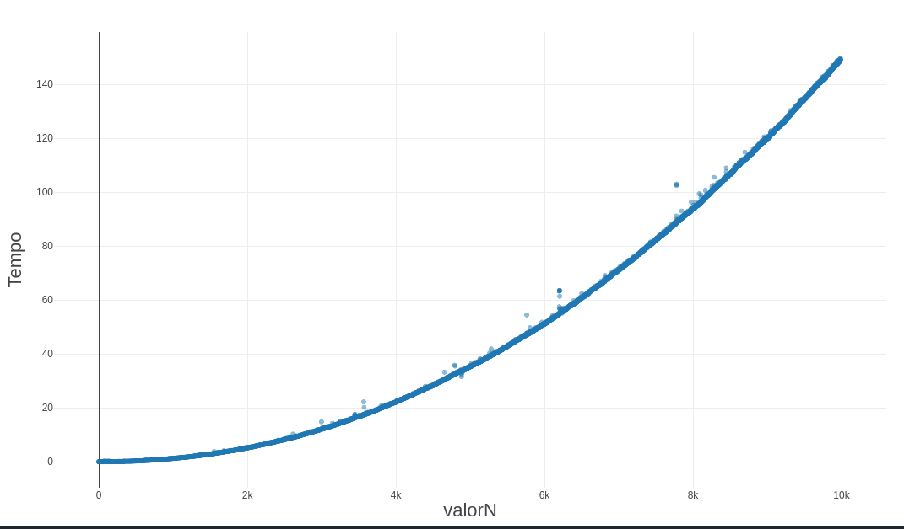

# Questão 1

a) Além de provar que o algoritmo termina e que dá a saída correta (A'[1] < A'2[2]... < A'[n]), é necessário provar que o algoritmo mantém a invariante de laço a cada iteração.

b) **Invariante de laço:** A cada iteração do loop **for**, o menor valor do sub-arranjo A[i : n] está contido dentro do sub-arranjo A[i : j], onde *n* é o comprimento do sub-arranjo, *i* o índice do laço exterior e *j* o índice do laço interior.

## Prova:
### Inicialização:
    Antes da inicialização do laço, *j* é igual a *n*, então o arranjo A[i : j] corresponde ao arranjo A[i : n], dessa maneira contendo o menor valor do arranjo A[i:n] igualmente.

### Manutenção:
    A cada iteração do loop, devido ao decréscimo do valor j, o arranjo A[i : j] se tornará um arranjo A[i : j-1]. Devemos analisar dois casos: **a)** Se o menor elemento do arranjo A[i : j] já estiver no arranjo A[i : j-1], a propriedade está mantida, satisfazendo a condição de manutenção. **b)** Se o menor elemento for o elemento A[j], a condicional *A[j] < A[j-1]* será satisfeita e os valores serão trocados, de maneira que o menor elemento irá para a posição A[j-1], mantendo a invariante na próxima iteração.


### Terminação:
    O laço termina quando *j* atinge um valor igual à *i+1*. Como i será um valor contido no intervalo [1,n] e a iteração de j começa em n e decresce (n, n-1, n-2... i), necessariamente o menor valor de j será i e o laço irá terminar.


# Questão 2

a) **Verdadeira**. A ordem de grandeza de g(n) é representada por Θ(g(n)) = Θ(log n²). Como essa função é o limite superior da função Θ(log n) e essa função é a ordem de grandeza das funções h(n) e log n, podemos afirmar que **g(n) é O(h(n))** e **g(n)=O(log n)**.

b) **Falsa**. O(n³) representa o limite superior da função f(n), pois a partir de determinado valor de n, a função cresce na mesma proporção e não acima da ordem de grandeza de O(n³). Pelo mesmos motivos, a função g(n) está na mesma ordem de grandeza se limita superiormente pela função O(log n). Porém h(n) se limita superiormente por O(n²) e não por O(n).

c) **Verdadeira**. A partir de um determinado valor de n, todos os valores de √𝑛 serão maiores que os valores de log n, então podemos dizer que Ω(log n) é o limite inferior de h(n) e está correta.

# Questão 3

Só podemos afirmar que A é mais rápido que B no caso 1 e no caso 3. No caso 1 podemos afirmar isso de maneira trivial, pois *log n* cresce mais devagar que *n³*, pois estão em ordens de grandeza diferentes(logarítmica e polinomial, respectivamente). 

Para afirmar em relação aos casos 2 e 3, precisamos provar que *n²log n* cresce mais rápido que *n²*, o que pode ser provado de calcularmos que o limite de *n² log n / n²* quando n tende ao infinito é infinito. Como ambos os termos da divisão tendem ao infinito, podemos aplicar a regra de L'Hopital e descobrir finalmente que *log n / 2* tende ao infinito.

# Questão 4

O algoritmo implementado tem por base o teorema de Dirichlet e sua progressão aritmética de números inteiros na forma *6n+1* ou *6n-1* para todos os primos além de 2 e 3.

a) A função *findNPrimes* para porque a cada iteração do laço *for* serão encontrados números primos maiores que os testados anteriormente e como o teorema de Euclides garante a existência de uma infinidade de números primos, em algum momento a lista será preenchida com o tamanho *n* ou *n+1* e a condição de parada será atingida.

b) Segundo o teorema de Dirichlet, todos os números inteiros caem dentro do seguinte conjunto de progressões aritméticas:

    6n+0
    6n+1
    6n+2
    6n+3
    6n+4
    6n+5

Podemos facilmente observar que todos os números que cairem nas progessões *6n+0*, *6n+2*, *6n+3* e *6n+4* serão divisíveis por algum número, seja 2 ou 3. Podemos observar também que *6n+5* e *6n-1* contém os mesmos números a partir de determinado ponto. Adicionando os dois primos iniciais, 2 e 3, podemos obter o restante apenas avaliando os números das duas progressões restantes (6n+1 e 6n-1). 

### Análise de complexidade:
```
function findPossiblePrimePair(i) {   // O(1)
    return [(6*i)-1, (6*i)+1]
}

function isPrime(number) {     // O(√number)
    for(var i =  Math.floor(Math.sqrt(number)) ; i > 1 ; i--)
        if(number % i == 0)
            return false;
    return true;
}


function findNPrimes(n) {
    var primes = [2, 3] // 1

    for(var i = 1 ;; i++) { //  no máximo n  

        if(primes.length == n)
            return primes        //1

        if(primes.length == n+1)
            return primes.slice(0, primes.length - 1)   //1
        
        var newPrimes = findPossiblePrimePair(i) 
        newPrimes.forEach(p => {
            if(!primes.includes(p) && isPrime(p))    // 2 * √p
                primes.push(p)
        })
    }
}

p = (6*n)-1 + (6*n)-1
f(n) =  n * 2√((6*n)-1 + (6*n) + 1) = n * 2√(6*n)² = 12n²
Θ(f(n)) = Θ(n²)
O(f(n)) = O(n²)

```

Sua complexidade assintótica é O(n²) e sua ordem de grandeza é polinomial.

Segue abaixo um gráfico do tamanho da entrada x tempo de execução, considerando 10 mil execuções do algoritmo. Podemos observar a natureza quadrática da curva encontrada.



# Questão 5

## MaxMin1
```
function maxMin1(vetor) {
    var max;    
    var min;

    for(var i = 0; i < vetor.length ; i++) {
        if(i == 0) {
            max = vetor[i]
            min = vetor[i]
        }

        if(vetor[i] > max)
            max = vetor[i]
        if(vetor[i] < min)
            min = vetor[i]
    }
    return [min, max]
}

```
## MaxMin2
```
function maxMin2(vetor) {
    var max;    
    var min;

    for(var i = 0; i < vetor.length ; i++) {
        if(i == 0) {
            max = vetor[i]
            min = vetor[i]
        }

        if(vetor[i] > max)
            max = vetor[i]
        else if(vetor[i] < min)
            min = vetor[i]
    }
    return [min, max]
}
```
## MaxMin3
```
function maxMin3(vetor) {
    var maiores = []
    var menores = []

    for(var i = 0; i < vetor.length; i = i + 2) {
        if (vetor[i] > vetor[i+1]) {
            maiores.push(vetor[i])
            menores.push(vetor[i+1])
        } else {
            maiores.push(vetor[i+1])
            menores.push(vetor[i])
        }
    }

    return [min(menores), max(maiores)]
}


function max(vetor) {
    var max = vetor[0]
    for(valor of vetor) {
        if(valor > max)
            max = valor
    }
    return max
}

function min(vetor) {
    var min = vetor[0]
    for(valor of vetor) {
        if(valor < min)
            min = valor
    }
    return min
}
```
## MaxMin4
```
function minRec(vetor, n) {
    if(n == 1)
        return vetor[0]    

    return min([vetor[n-1]].concat(minRec(vetor, n-1)))
}

function maxRec(vetor, n) {
    if(n == 1)
        return vetor[0]

    return max([vetor[n-1]].concat(maxRec(vetor, n-1)))
}

function MinMax4(vetor) {
    return [
        minRec(array, array.length),
        maxRec(array, array.length)
    ]
}
```

A função maxMin1 realizada 2(n-1) + 1 comparações. A função MaxMin2 continua realizando 2(n-1) + 1 comparações no pior caso, mas já tem um melhor caso superior ao da função anterior. A função MaxMin3 possue a mesma ordem de grandeza das anteriores, mas tem um desempenho mais estável para todos os casos, realizando 3n/2 - 1 comparações para todos os casos. A função 4 realiza com o mesmo número de comparações, porém está implementada de maneira recursiva.

# Questão 6

Letra C. O algoritmo é exponencial porque sua complexidade é determinada pela complexidade de realizar cada um dos termos fib(n-1) e fib(n-2), dobrando a cada nível que se desce na árvore de recursividade.  Dessa maneira podemos afirmar que sua complexidade assintótica é O(2^^n) (2 elevado ao expoente n).


# Questão 7

a) As 5 inversões do arranjo são: (2,1), (3,1),(8,6), (8,1), (6,1).

b) O arranjo que tenha n elementos ordenandos de maneira inversa (do maior para o menor). esse conjunto tem (n-1)! inversões.


# Questão 8


# Questão 9

a) Podemos demonstar que f(n) é O(g(n)) se pudermos demonstrar que o limite de f(n)/g(n) é diferente de infinito e diferente de 0 quando n tende ao infinito. Utilizando a regra de L'Hopital, podemos obter que o limite é -1, portanto satisfazendo a propriedade de comparação dos limites.

b) A notação Ω representa o limite inferior de um determinado comportamento assintótico. Se diz que *x²* é *Ω(x)*, porque *x²* cresce pelo menos tão rápido quanto *x*. A outra afirmação não é verdadeira, pois *x* não cresce tão rápido quanto *x²*, portanto afirmar que *x* é *Ω(x)* é falso.

# Questão 10

Mesmo que para 1.024 itens o algoritmo B seja mais eficiente, podemos observar que sua ordem de grandeza é diferente do algoritmo A. O algoritmo B tem uma ordem de grandeza polinomial(*O(n²)*), enquanto o algoritmo A tem uma ordem de grandeza linear, dominada pelo termo *n* (*O(nlog n)*). Para entradas muito grandes(ex. 2^^20), certamente o algoritmo A irá se comportar de maneira mais eficiente.


